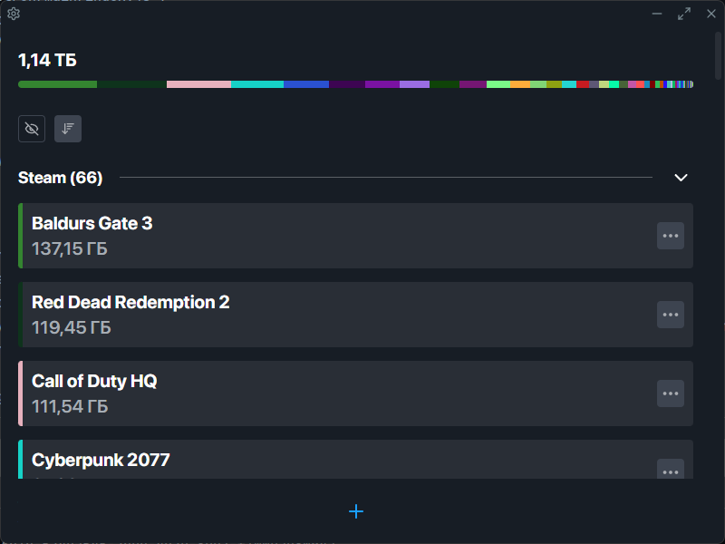
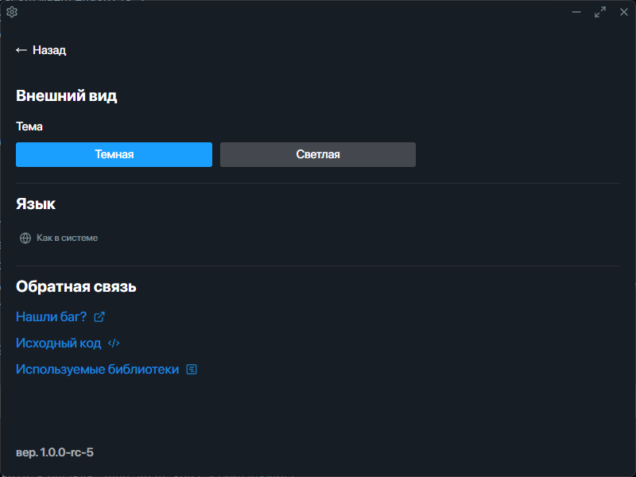

# Game Size Tracker

This program allows you to track size of all your installed games!

## Overview
### Main page


### Settings page


### Features
- Tracking size of Steam and EGS games
- Tracking custom paths
- Language change (eng/rus)
- Dark and light themes

## Node version note

**Important!** This project requires Node version `v18.17.0` because modern libs are used.

If you use nvm like me, execute these commands:
```shell
nvm install 18.17.0
nvm use 18.17.0
```

## How to build manually

```shell
yarn build
```

After that you can find complete build in `release` folder (installer and unpacked version).
